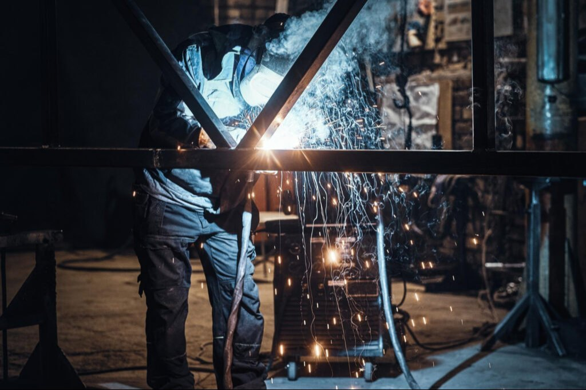
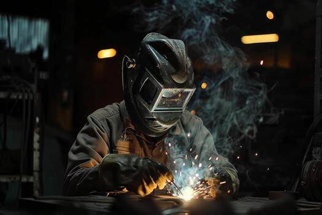
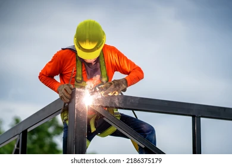
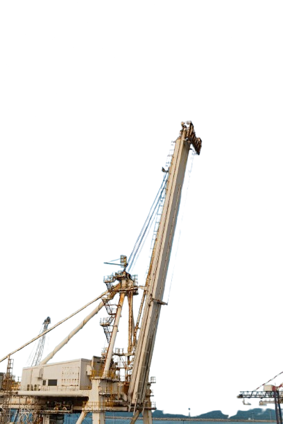
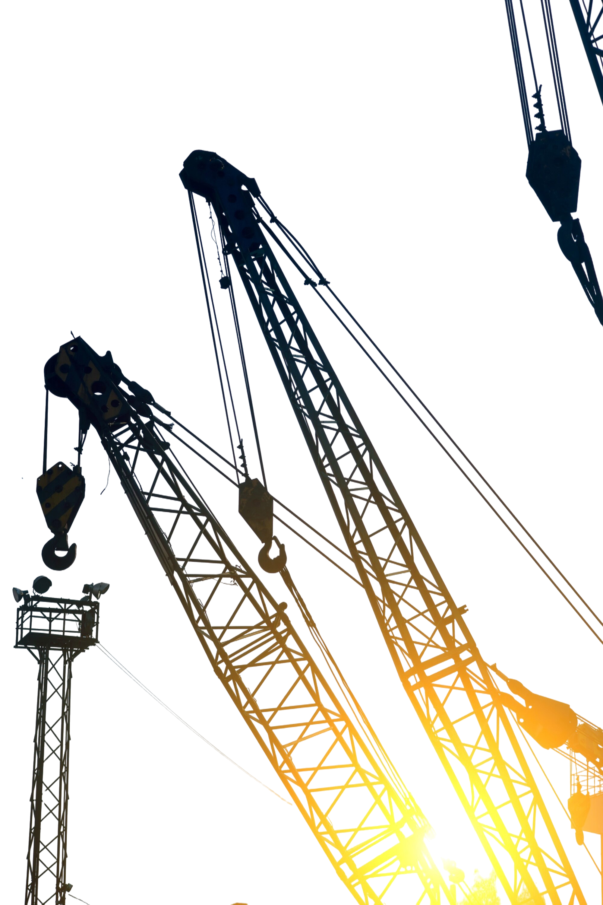
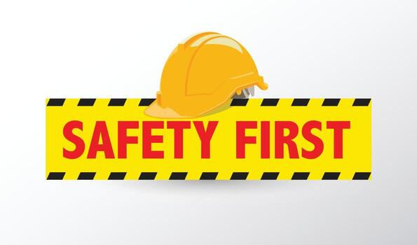
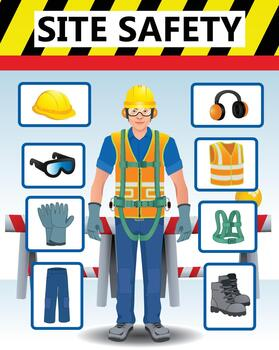

# DOMA FABRICATORS
## Engineering Par Excellence

**Design & Engineering | Equipment's Supply | Project Works**

**15+ Years of Excellence**

---

## Leadership & Company Overview

### Mr. Varghese K. A. — Proprietor & Visionary Leader

Mr. Varghese K. A. is a visionary leader and proprietor of Doma Fabricators. With 14+ years of experience in the mechanical engineering and fabrication industry, he has been instrumental in shaping the company's legacy and steering its steady growth. Known for his deep expertise in mechanical fabrication, precision engineering, and an unwavering commitment to quality, Varghese K. A. has built strong, lasting client relationships and driven Doma Fabricators to excel.

Under his leadership, the company has successfully delivered complex projects, merging traditional values with innovative practices to meet the evolving demands of the industry. His hands-on approach, mentorship of the team, and relentless focus on process improvement and adoption of new technologies are central to Doma Fabricators' reputation for reliability, technical excellence, and client satisfaction.

---

### Company Profile

Doma Fabricators is a professionally managed industrial fabrication company with over 15 years of proven experience. We specialize in:

- **Piping Works** — Industrial piping solutions for diverse applications
- **Heavy Structural Fabrication** — Large-scale steel structures and frameworks
- **Equipment Erection** — Precision installation and commissioning
- **Industrial Maintenance** — Comprehensive maintenance services
- **Shed Works & Roofing** — Industrial shed construction and roofing solutions

We provide end-to-end support for new projects and plant expansions, handling heavy structure fabrication, precision piping, equipment erection, and roofing/shed construction. Our team ensures strict compliance with quality, safety, and timely delivery standards, making us a trusted partner for large-scale industrial projects.

In addition, we offer comprehensive maintenance services that help clients optimize efficiency, minimize downtime, and extend the lifecycle of their equipment and facilities.

With dedicated in-house fabrication facilities, we manufacture and assemble specialized industrial equipment such as:

- Tank Farms
- SS/MS Tanks
- EOT Cranes
- Reactors
- Chimneys
- Silos

Our on-site fabrication capabilities allow us to handle complex installations efficiently, customized to client requirements.

At Doma Fabricators, we combine technical expertise, skilled manpower, and modern fabrication techniques to deliver solutions that create long-term value. Our commitment to safety, quality, and client satisfaction has established us as a dependable partner for leading companies.

---

## Industries We Specialize In

### Pharmaceutical Industries

Our team is highly skilled and possesses extensive experience in mechanical works specific to the pharmaceutical industry. We understand the unique requirements and standards of this sector, ensuring that every project we undertake meets the stringent quality and safety standards necessary for pharmaceutical production. Our expertise in handling precision equipment and maintaining cleanroom environments makes us a trusted partner in the pharma industry.

### Chemical Industries

We specialize in providing top-notch mechanical solutions for the chemical industry. Our team is well-versed in the complexities of chemical processes and the equipment used to manage them. With a strong focus on safety and efficiency, we ensure that our services meet the rigorous demands of chemical manufacturing. From installation to maintenance, we are committed to supporting your operations with reliable and effective solutions.

### Petroleum Refinery Industries

With years of experience in the petroleum refinery industry, our team is equipped to handle the most challenging mechanical tasks. We understand the critical nature of refinery operations and the importance of minimizing downtime. Our expertise in working with refinery equipment ensures that we deliver high-quality services that enhance operational efficiency and safety. We are dedicated to supporting the refining process with precision and care.

### Painting Industries

Our team excels in providing specialized mechanical services to the painting industry. We are experienced in managing the unique challenges associated with large-scale painting operations, including the maintenance and setup of painting booths and equipment. Our focus is on ensuring that your painting processes run smoothly and efficiently, with minimal disruptions. We are committed to delivering services that meet the highest standards of quality and safety.

---

## Our Services

**Core Service Categories:**
- New Projects
- Project Expansions
- Annual Maintenance
- Shut Down Activities
- Site-Tank Fabrication

### Detailed Services

#### 1. Piping
With years of industry experience, we are offering Piping Projects. Piping services manufactured from high quality materials. Our Plant Piping Services is highly suitable for diverse industrial application.

#### 2. Site-Tank Fabrication
We have mastered the art of Tank fabrication and continue to grow and evolve to meet the demands of a wide variety of industries and applications.

#### 3. Equipment Erection
These services can be availed from us at industry leading prices and can be customized according to the customer requirements. We are serving the customers with skilled, experienced engineers.

#### 4. Man Power Supply
Our organization is instrumental in providing the best Man Power Supply to our esteemed clients. In compliance with the specific requirements of clients, we provide man power for various industries.

#### 5. Heavy Structurals
We have the uniqueness of expanding its work beyond steel Buildings and undertaking fabrication work for various structural steel projects.

#### 6. Insulation
We provides bespoke solutions, offering clients looking for insulation services an end-to-end service to meet their thermal insulation requirements.

#### 7. Sand Blasting
We are instrumental in offering a wide assortment of Sand Blasting services to our clients. The service offered by us is executed by expert professionals utilizing advanced resources and amenities.

---

## Products & Equipment

### Tanks & Chimney

**Tank Farm**
- 100 KL to 500 KL Bulk Storage
- M.S / S.S / FRP Lining

**Chimney & Ducting**
- 30 MTR. to 60 MTR.

**Boiler & Furnace**

### Silos

**Bulk Storage**
- Flat Bottom
- Conical Bottom
- M.S / S.S / G.I

### Structure Fabrication & Erection

- Roof Trusses, Industrial Sheds
- Column, Gantries
- Machinery Structure
- Working Platform, Pipe Racks

---

## Safety Standards

At Doma Fabricators, safety is our top priority. We believe that a safe workplace is fundamental to operational success and the well-being of our employees, clients, and the communities we serve. Our commitment to safety is reflected in our comprehensive safety management system, which is designed to prevent accidents, protect the environment, and ensure compliance with all relevant safety regulations.

### Safety Management System

- **Risk Assessment:** Identifying and controlling hazards before work begins.
- **Training & Awareness:** Regular safety training, drills, and workshops for all employees.
- **PPE Compliance:** Providing and enforcing the use of personal protective equipment.
- **Audits & Inspections:** Routine checks to maintain strict safety standards.
- **Incident Management:** Transparent reporting, investigation, and corrective actions.
- **Emergency Preparedness:** Well-defined response plans and regular mock drills.
- **Regulatory Compliance:** Full adherence to all safety laws and standards.
- **Continuous Improvement:** Regular updates to align with best practices and technology.

We nurture a safety-first culture, where every employee takes responsibility for maintaining safe operations. Partnering closely with our clients, we ensure all projects exceed safety expectations. Our dedication has earned us certifications and recognition, reaffirming our position as a trusted, safety-driven organization.

---

## Quality Control (QC)

At Doma Fabricators, quality is the cornerstone of our operations. We maintain rigorous QC processes to ensure every project meets the highest standards of excellence.

### QC Processes

- **Material Inspection:** All incoming materials are verified for compliance with client and industry standards.
- **In-Process Inspection:** Continuous monitoring during fabrication and erection ensures early detection and correction of issues.
- **Final Inspection:** Detailed checks on dimensions, welding, and finishes guarantee flawless project completion.
- **Testing:** Non-destructive and destructive tests (radiographic, ultrasonic, pressure, etc.) validate the integrity of our work.
- **Documentation:** Complete traceable records ensure transparency and accountability.

Our commitment to quality drives us to exceed client expectations and uphold our reputation as a trusted, high-quality service provider in the mechanical engineering industry.

---

## Major Projects Portfolio

1. **Aarti Surfactant Pvt. Ltd**, Sector-03, Pithampur (DHAR) — Project & Maintenance — 2010–Till
2. **Priyanshu Chemical Pvt. Ltd**, Sector-03, Pithampur (DHAR) — P & M — 2010
3. **Panasonic Energy India Ltd**, Sector-03, Pithampur (DHAR) — Project — 2024
4. **Shri Insulation India Pvt. Ltd**, (MP) — Project — 2024
5. **Ralson Tyres Limited**, Smart Industrial Park, Pithampur — Project — 2021–2024
6. **Pensol Lubricants Limited**, Sector-03, Pithampur (DHAR) — Project — 2021–Till
7. **SRF Limited**, Sector-03, Pithampur (DHAR) — Maintenance — 2024
8. **ACG-Associated Capsule Pvt. Ltd**, Sector-03, Pithampur (DHAR) — Maintenance & Project — 2024–Till
9. **Unichem Laboratories Limited**, Sector-03, Pithampur (DHAR) — Project — 2024–Till
10. **Aperam Alloys India Pvt. Ltd**, Sector-03, Pithampur Industrial Area (M.P) — Maintenance & Project — 2024–Till
11. **Bio Innovation Clad Solution Pvt. Ltd**, Sector-03, Pithampur Industrial Area (M.P) — Project — 2025–Till
12. **Okay Firm Precision Casting Pvt. Ltd**, Sector-03, Pithampur Industrial Area DHAR (M.P) — Project — 2024–Till
13. **SPM Auto comp System**, Sector-02, DHAR (M.P) — Maintenance — 2023–Till
14. **Kesar Alloys & Metals Pvt. Ltd**, Pithampur DHAR (M.P) — Project — 2022–2024
15. **Dhar Automotives**, Sector-01, Pithampur DHAR (M.P) — Project — 2014–2017
16. **Advance Enzymi Tech. Ltd**, Sector-03, Pithampur Industrial Area (M.P) — Maintenance — 2022–2025
17. **Madhur India Exports**, Special Economic Zone 1, Indore-Dhar (M.P) — Project — 2017–2020

---

## Esteemed Clients

.png)

---

## Get In Touch

**Email:** domafabricators@gmail.com

**Phone:**
- +91 9826051620
- +91 9098324240
- +91 9111887856

**Address:**
Plot No. 1J, Kheda, Sagorekutti
Pithampur Industrial Area, Sector-3
Pithampur, Dhar (M.P) 454 775

---

*© 2024 Doma Fabricators. All Rights Reserved.*
